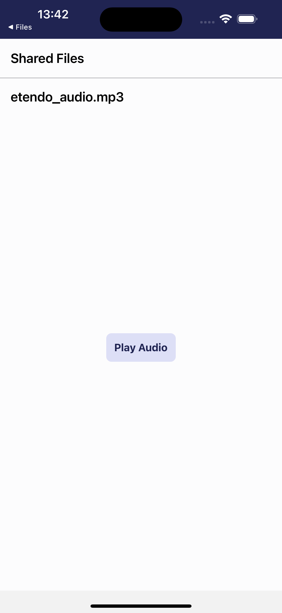

# 📂 Docs Manager Subapp

This Etendo Classic module includes a sub-application to receive and manage externally shared files within Etendo Mobile.

Welcome to the **Docs Manager Subapp** repository! This project allows your Etendo Mobile app to seamlessly receive and handle files (PDFs, images, audio, text, etc.) shared from external apps.  

## 🎬 Demo Screenshots

Watch how the Documents Manager Subapp works in action!

<div style="display: flex; justify-content: space-between;">
  
  
  
</div>

## 🌟 Features
- **Receive Shared Files** directly from other mobile apps.
- **Preview PDFs** with [`react-native-pdf`](https://github.com/wonday/react-native-pdf).
- **View Images** in an embedded image viewer.
- **Play Audio** using [`react-native-sound`](https://github.com/zmxv/react-native-sound).
- **Read Text Files** via [`react-native-fs`](https://github.com/itinance/react-native-fs).
- **Multiple File Support**: handle multiple shared files in one go.
- **Easy Navigation**: seamlessly integrate with your existing navigation stack.

## Workflow for Handling Shared Files
1. User shares a file from an external application.
2. The OS presents Etendo Mobile as a share option.
3. A pop-up opens, showing the available sub-apps with the possibility to receive external files. When selecting a subapp, Etendo Mobile opens, opening the corresponding subapp by passing the array of files in the sharedFiles property.
4. The sub-application processes each file based on its MIME type (PDF, image, audio, text, etc.).
5. In this case the user can interact with the content (view, read, listen, or handle unsupported file types accordingly).

## 🏗️ Project Structure

**Root directory:**  
```
com.etendoerp.subapp.docsmanager/
├─ README.md
├─ sonar-project.properties
├─ subapp
│  ├─ App.tsx
│  ├─ android
│  ├─ app.json
│  ├─ babel.config.js
│  ├─ etendo.config.json
│  ├─ Gemfile
│  ├─ __tests__/
│  ├─ index.js
│  ├─ ios
│  ├─ jest.config.js
│  ├─ jest.setup.js
│  ├─ lib/
│  ├─ metro.config.js
│  ├─ nodemon.json
│  ├─ package.json
│  ├─ rollup.config.js
│  ├─ src/
│  ├─ styles.ts
│  ├─ tsconfig.json
│  └─ yarn.lock
├─ node_modules/
├─ src-db/
└─ web/
```
<
### Explanation

- **`subapp/`**: Core implementation of the Docs Manager Subapp.
  - **`App.tsx`**: Main entry point for the subapplication.
  - **`src/`**: Contains the source code (screens, components, utilities).
  - **`styles.ts`**: Shared styling for the subapp.
  - **`babel.config.js`**, **`rollup.config.js`**, **`tsconfig.json`**: Build and transpilation settings.
  - **`ios/`, `android/`**: Platform-specific folders (if you need native modules or custom configs).
  - **`jest.config.js`**, **`__tests__`**: Testing configuration and test files.
- **`src-db/`, `web/`**: Additional folders for module database structure  and  web builds (in this case, the compiled sub-application is distributed here)

## 📝 Prerequisites & Setup

1. **Environment**: Make sure you have an environment with **Etendo Classic** and the **Etendo Mobile** app installed.
2. **Install this module**: Clone the content of this repository in the `/modules` folder of your Etendo environment and in the root project run the Gradle command to install the sub-application: 
    ```bash
    ./gradlew update.database compile.complete smartbuild
    ```
3. **Subapp Enabled to receive files**: When installing this sub-application, the necessary configurations will already be distributed, but it is important to highlight that in order to be able to share files to any sub-application, in the **Dynamic App** window in Etendo Classic, the check `Receive External Files` in the Dynamic App Version tab must be checked.
   

4. **OPTIONAL**: This sub-application is distributed already compiled, but **only in case** you want to build this sub-application in development mode, you will have to execute only once the commands:
   a. **Install Dependencies**: In a terminal inside the sub-application
      ```bash
      cd /modules/com.etendoerp.subapp.docsmanager
      yarn install
      cd ios && pod install && cd ..
      ```
   b. **To run the sub-application in development mode:**
      ```bash
      yarn dev
      ```

## 🚀 Usage

1. **Pass `sharedFiles` parameter** As we can see in the definition of the sub-application [subapp/App.tsx](./subapp/App.tsx), an array of files is received from the Etendo Mobile, which can then be processed within the sub-application
   
    ```tsx
    ...
   
    interface AppProps {
    language: string;
    dataUser: IData;
    navigationContainer: INavigationContainerProps;
    sharedFiles: IFile[]; // <- Parameter Type
    }
    ...
   
    const Stack = createStackNavigator();
    
    const App: React.FC<AppProps> = ({
    language,
    navigationContainer,
    dataUser,
    sharedFiles, //  <- Input Parameter
    }) => {
    ...
   
    <Home
     language="en"
     dataUser={dataUser}
     navigationContainer={navigationContainerProps}
     sharedFiles={sharedFiles}  //  <- Parameter Usage
    />
   ```

2. **Process the files** in Home Screen [/subapp/src/screens/home/index.tsx](./subapp/src/screens/home/index.tsx ), as we can see in this example sub-application, in the main screen the file(s) are received and treated according to their format.

    ```tsx
        const Home: React.FC<HomeProps> = ({ navigationContainer, sharedFiles }) => {
        // Access the sharedFiles prop
        // Render previews based on the file type (PDF, image, audio, text, etc.)
        };
    ```
   What the Code Does: 
   - Retrieves the sharedFiles prop.
   - Renders a list of shared files if multiple files are passed or displays the contents of a selected file.
   - When selecting a file:
     - Render PDFs using `react-native-pdf`
     - Render images using the standard `<Image>` component.
     - Play audio using `react-native-sound` and Etendo Ui Library `<Button>` for playback controls
     - Render text files using `react-native-fs` to read them and show the content in a `<ScrollView>`

##  💬 Contact
For any inquiries or more information, visit [**Etendo Software**](https://etendo.software/).
