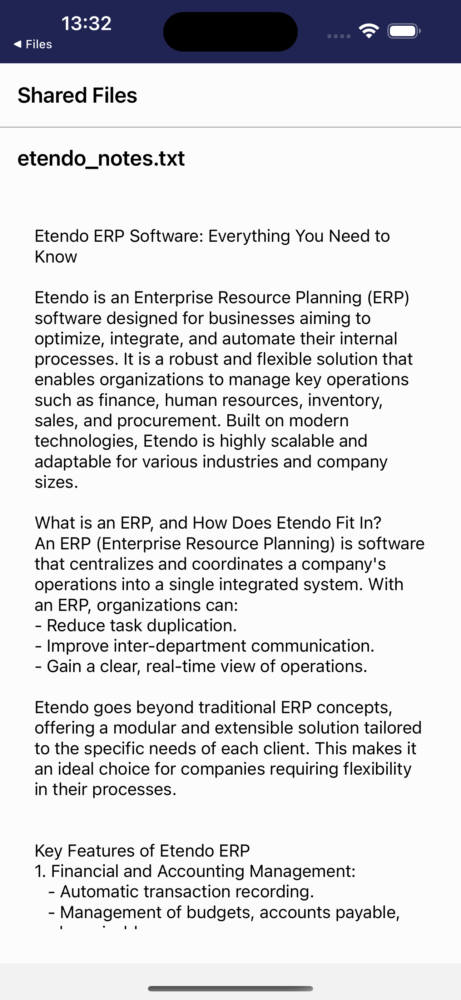
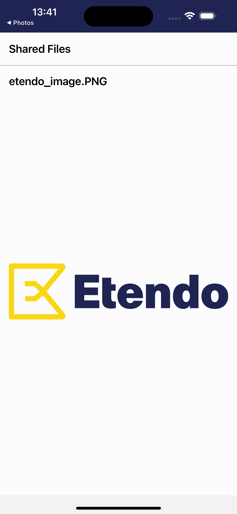
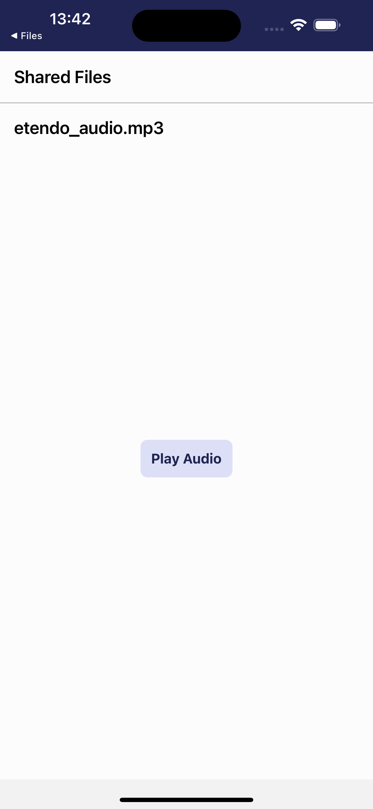
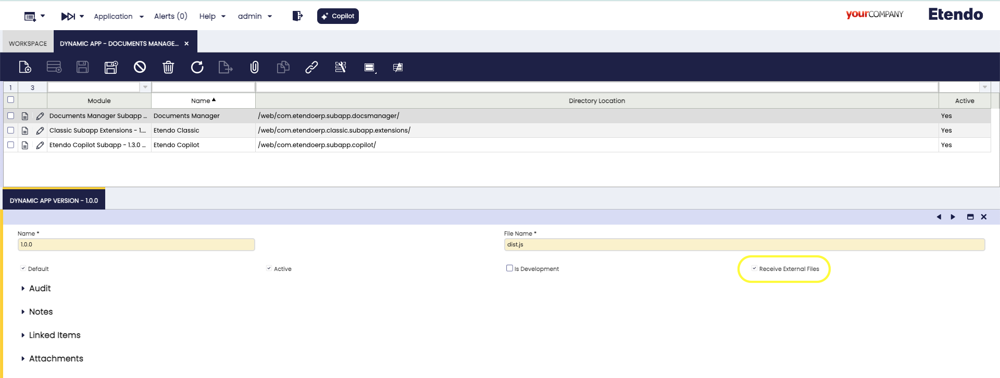

# 📂 Docs Manager Subapp

**A subapplication for receiving and managing externally shared files within Etendo Mobile**  

Welcome to the **Docs Manager Subapp** repository! This project allows your Etendo Mobile app to seamlessly receive and handle files (PDFs, images, audio, text, etc.) shared from external apps.  

## 🎬 Demo Screenshots

Watch how the Documents Manager Subapp works in action!

<div style="display: flex; justify-content: space-between;">
  
  
  
</div>

## 🌟 Features
- **Receive Shared Files** directly from other mobile apps.
- **Preview PDFs** with [`react-native-pdf`](https://github.com/wonday/react-native-pdf).
- **View Images** in an embedded image viewer.
- **Play Audio** using [`react-native-sound`](https://github.com/zmxv/react-native-sound).
- **Read Text Files** via [`react-native-fs`](https://github.com/itinance/react-native-fs).
- **Multiple File Support**: handle multiple shared files in one go.
- **Easy Navigation**: seamlessly integrate with your existing navigation stack.

## 🏗️ Project Structure

**Root directory:**  
```
com.etendoerp.subapp.docsmanager/
├─ README.md
├─ sonar-project.properties
├─ subapp
│  ├─ App.tsx
│  ├─ android
│  ├─ app.json
│  ├─ babel.config.js
│  ├─ etendo.config.json
│  ├─ Gemfile
│  ├─ __tests__/
│  ├─ index.js
│  ├─ ios
│  ├─ jest.config.js
│  ├─ jest.setup.js
│  ├─ lib/
│  ├─ metro.config.js
│  ├─ nodemon.json
│  ├─ node_modules/
│  ├─ package.json
│  ├─ rollup.config.js
│  ├─ src/
│  ├─ styles.ts
│  ├─ tsconfig.json
│  └─ yarn.lock
├─ node_modules/
├─ src-db/
├─ web/
└─ yarn.lock
```

### Explanation

- **`subapp/`**: Core implementation of the Docs Manager Subapp.
  - **`App.tsx`**: Main entry point for the subapplication.
  - **`src/`**: Contains the source code (screens, components, utilities).
  - **`styles.ts`**: Shared styling for the subapp.
  - **`babel.config.js`**, **`rollup.config.js`**, **`tsconfig.json`**: Build and transpilation settings.
  - **`ios/`, `android/`**: Platform-specific folders (if you need native modules or custom configs).
  - **`jest.config.js`**, **`__tests__`**: Testing configuration and test files.
- **`src-db/`, `web/`**: Additional folders for database or web builds (optional for certain projects).
- **`node_modules/`, `yarn.lock`**: Dependencies and lock file.

## 📝 Prerequisites & Setup

1. **Etendo Mobile**: Make sure you have a working Etendo Mobile environment.
2. **Enable Subapp**: In the **Dynamic App** window in ERP, create or edit a subapplication entry for the Docs Manager.
   - Set `Is Receive Files` to `true`.
   
3. **Install Dependencies**:
   ```bash
   yarn install
   ```
4. **Link Native Modules**:
   ```bash
   cd ios && pod install && cd ..
   ```

## 🚀 Usage

1. **Pass `sharedFiles`** to the subapplication from your main `App.tsx`:
   ```tsx
   // Inside your Etendo Mobile's main App component or navigation file
   <App
     language="en"
     dataUser={dataUser}
     navigationContainer={navigationContainerProps}
     sharedFiles={sharedFiles}  // <-- Important!
   />
   ```

2. **Process the files** in `Home.tsx` (Docs Manager Subapp):
   ```tsx
   const Home: React.FC<HomeProps> = ({ navigationContainer, sharedFiles }) => {
     // Access the sharedFiles prop
     // Render previews based on the file type (PDF, image, audio, text, etc.)
   };
   ```

3. **Share files** from any external app on your device.  
   - When prompted to choose an app, select **Etendo Mobile** (Documents Manager Subapp).
   - The shared files appear in the `sharedFiles` array.

##  💬 Contact

For any inquiries or more information, visit [**Etendo Software**](https://etendo.software/).
